# OpenMDP-RE
$\color{#FF4444}{\textsf{!!! WARNING !!!}}$  
It is possible to hard-brick (i.e. make it unusable without significant hardware modification) the MDP-M01 if you do not know what you are doing or are not careful. This repository is provided as-is, with no guarantees or warranty of any kind. You are solely responsible for your own actions.  
$\color{#FF4444}{\textsf{!!! WARNING !!!}}$  

This project is an effort to reverse engineer the Miniware MDP-M01 control module solely for educational purposes and to promote interoperability with external devices through the development of custom firmware or similar solutions.  
No proprietary material of any kind from the original manufacturer has been used in (the creation of) this project.  
This project is not affiliated with, endorsed by, or associated with Guangzhou e-Design Intelligent Technology Co., Ltd. or the Miniware brand.

### Contents
- [Hardware](#hardware)
  - [PCB](#pcb)
    - [Schematic](#schematic)
    - [MCU Pinout](#mcu-pinout)
  - [LCD Display](#lcd-display)
  - [Rotary encoders](#rotary-encoders)
- [Firmware](#firmware)
  - [Original Firmware](#original-firmware)
  - [Custom Firmware](#custom-firmware)
  - [Flashing/Debugging](#flashingdebugging)
    - [Flashing](#flashing)
    - [Debugging](#debugging)
  
<br>  

# Hardware
The hardware is pretty simple. The PCB is purely digital and only consists of an MCU with a few peripherals.  
Ignoring passives and supporting/power components, these are the most interesting:

| nr | amount | component                      | function       | notes                                                                           |
|----|--------|--------------------------------|----------------|---------------------------------------------------------------------------------|
| 1  | 1      | STM32F103VCT6 or<br>GD32Fxxx | MCU            |                                                                                 |
| 2  | 1      | Z280IT002 v0.3                 | TFT LCD        | ILI9341 driver, connected via I8080 style<br>parallel interface (16 data lines) |
| 3  | 1      | W25Q64JV                       | SPI flash      |                                                                                 |
| 4  | 1      | Si24R1 module                  | RF module      |                                                                                 |
| 5  | 2      | Kailh EN8080 series            | rotary encoder | uncommon output waveform, see rotary<br>encoder section below for details       |
| 6  | 5      | unknown                        | button         |                                                                                 |
| 7  | 1      | unknown                        | buzzer         |                                                                                 |
| 8  | 1      | unknown                        | LED            | combined red/blue                                                               |


## PCB

There appear to be at least two PCB revisions that have been sold. The first MDP-M01 I have access to was purchased in April 2020, the other two both in December 2024. Looking at the silkscreen on the PCBs, the older version is marked as 121, let's call it v1.21, while the newer ones are both marked as v1.3.

<p align="center">
  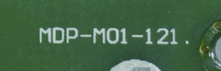
  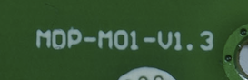
</p>

#### There are two major differences between these two.
1. In v1.3, the STM32F103 was replaced with a GD32Fxxx, an STM32 clone made by GigaDevice.
2. In v1.21, there is a mechanism to toggle the power to peripheral devices (LCD, SPI flash, etc.) using a GPIO pin. This capability is no longer present in v1.3.

#### 1.) STM vs GD
I suspect multiple different models of clones are being used, since the MCU in my device is marked GD32F***3***03, but in the DFU menu it is listed as GD32F***1***03.
Functionally these are pretty similar (though the F***3***03 is actually a cortex m4) and only one binary is provided across all MDP-M01 revisions by the manufacturer. I have been able to set up an STM CubeMX project with the STM32F103VCT6 using code generation and so far the resulting binary seems to be compatible with both of my M01 models without noticeable issues. There are some differences though, like the clones usually supporting a higher max clock speed and having more flash/sram.

<p align="center">
  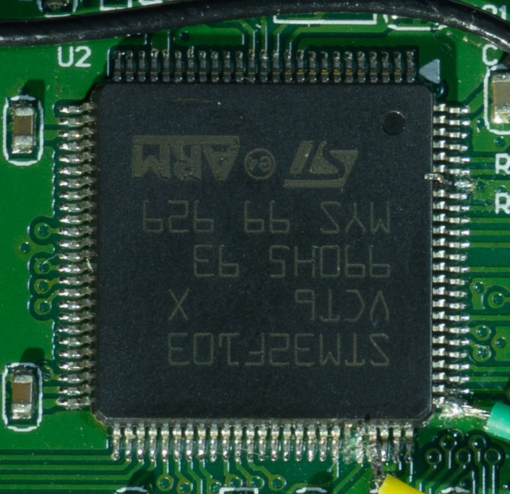
  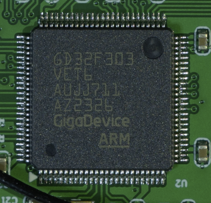
</p>

#### 2.) Peripheral power switching
Vcc_main powers the MCU, Vcc_periph powers all peripherals like the LCD, SPI flash, RF module, etc..  
I truly do not know what the intention was here. R5 was repurposed in a different, unrelated, part of the schematic in v1.3, see full schematic for details. All components in the two images below are populated.
As a result of this change, it is no longer possible to turn off power to the peripherals in software in v1.3.

<p align="center">
  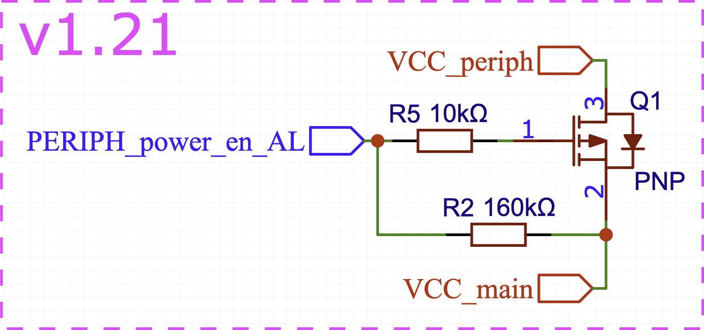
  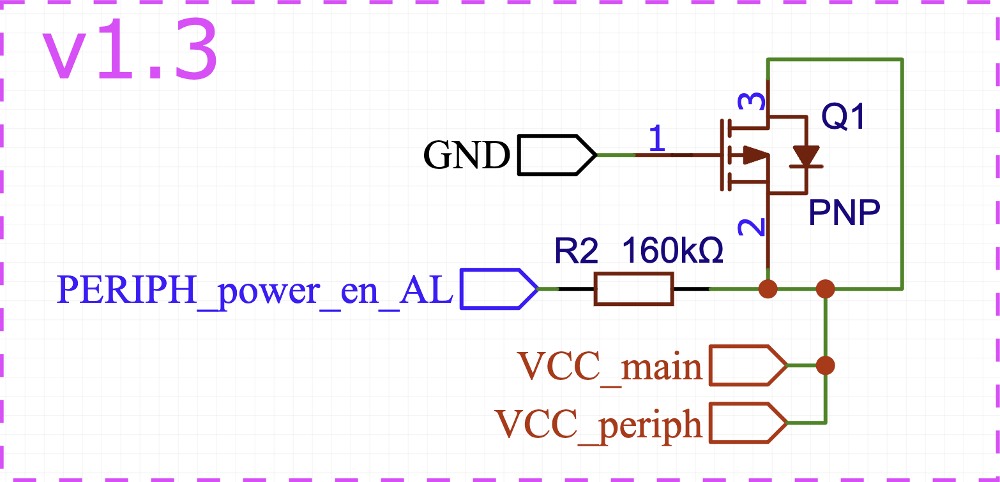
</p>

### Schematic
The schematic can be found in [/hw/schematic/](/hw/schematic) as an EasyEDA schematic json and PDF.  

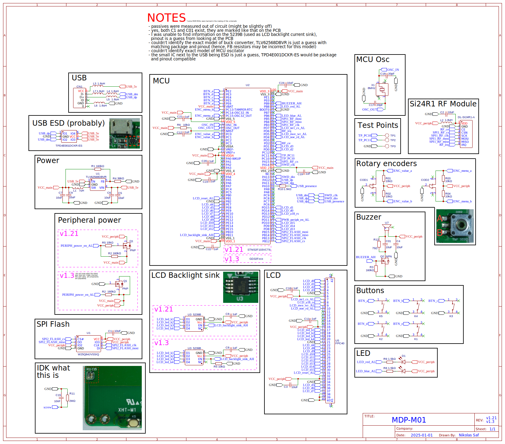

### MCU Pinout
The CubeMX file can be found in [fw/custom_fw/m01_re/](fw/custom_fw/m01_re/)  
Notes:  
-all NC_ pins are left floating on the PCB and configured as analog inputs and should have their internal pull down resistors enabled in software  
-GND_PB2: directly tied to gnd, no other connections  
-TP_PC10: testpoint, no other connections  
-TP_PC11: testpoint, no other connections  

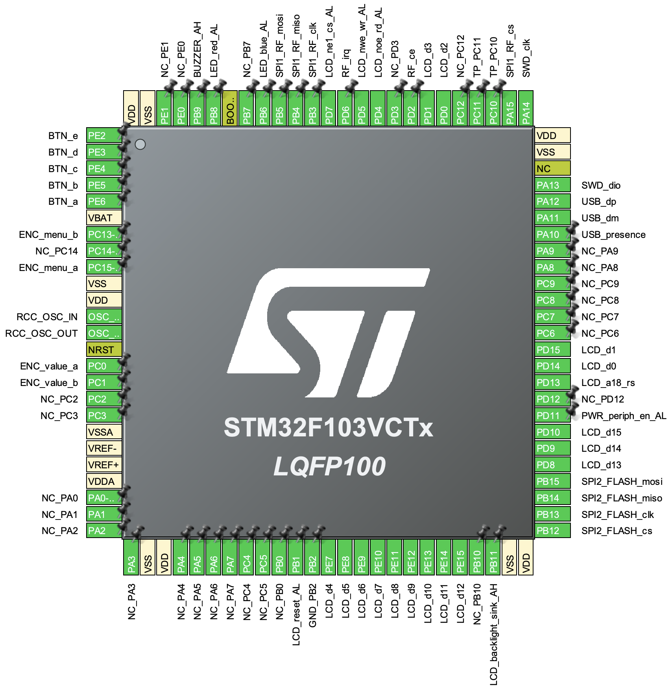


## LCD Display
For the display the **Z280IT002 v0.3** module is used, a 2.8" 240x320 TFT LCD driven by an ILI9341 connected via an I8080 style parallel interface with 16 data lines. A flex pcb is used to adapt the 37 pin connector that comes with the module to a more compact 40 pin one. The pinout is 1 to 1, with the addition of 3 ground connections after pin 37 to go from 37 to 40 pins.

<p align="center">
  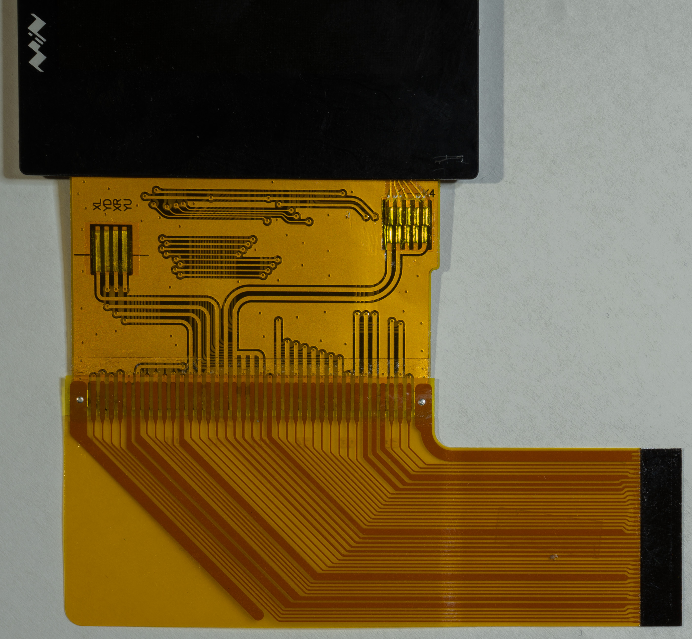
  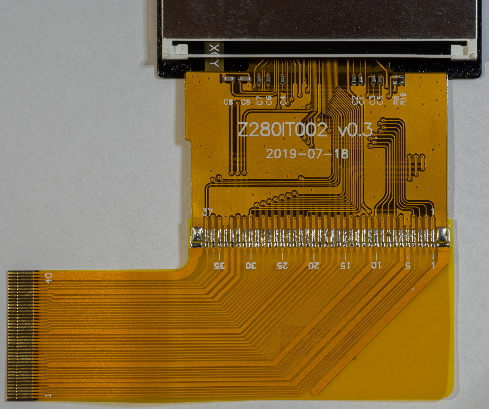
</p>

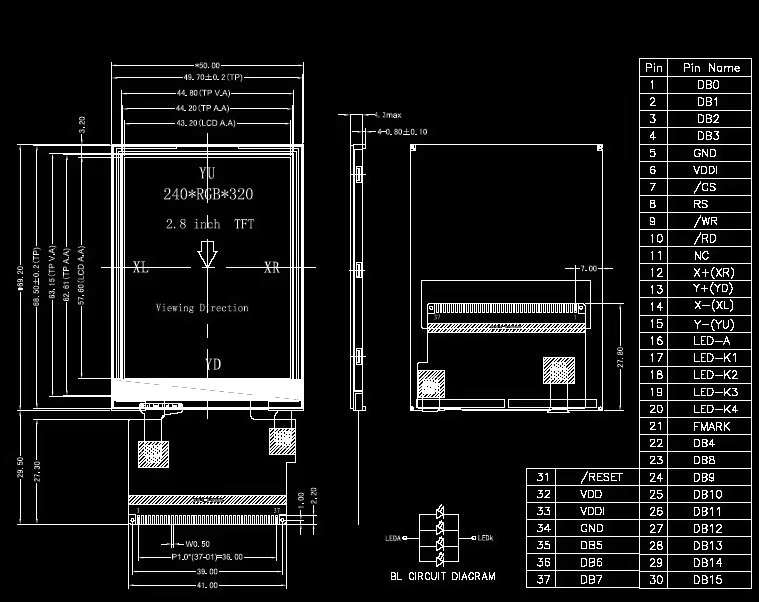


## Rotary encoders
The rotary encoders have a somewhat unusual waveform. With each detent the A and B pins rise or fall together, with a slight delay between the two every second detent. They also show a decent amount of bouncing, especially when rotated slowly.  

When looking at the device from the top:
- Rotating clockwise, the $\color{#d9dc47}{\textsf{A}}$ and $\color{#64d9d7}{\textsf{B}}$ pins **rise** at exactly the same time and $\color{#d9dc47}{\textsf{A}}$ **falls** before $\color{#64d9d7}{\textsf{B}}$ does.  
- Rotating counterclockwise, the $\color{#d9dc47}{\textsf{A}}$ and $\color{#64d9d7}{\textsf{B}}$ pins **fall** at exactly the same time and $\color{#64d9d7}{\textsf{B}}$ **rises** before $\color{#d9dc47}{\textsf{A}}$ does.  

#### Clockwise
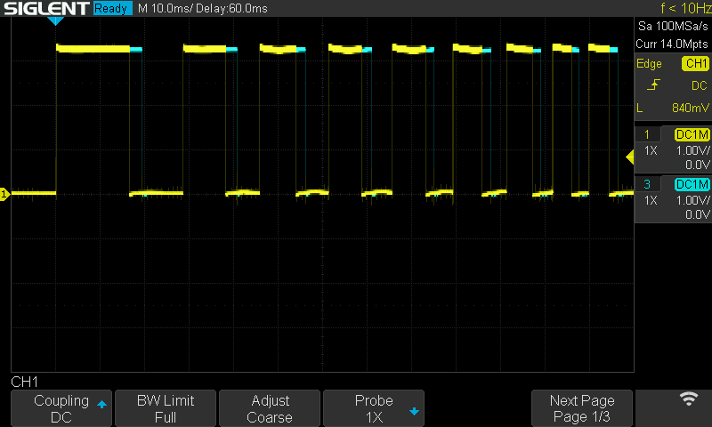
#### Counterclockwise
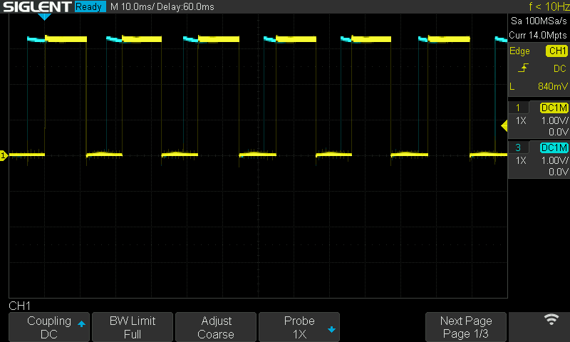
#### Bouncing example
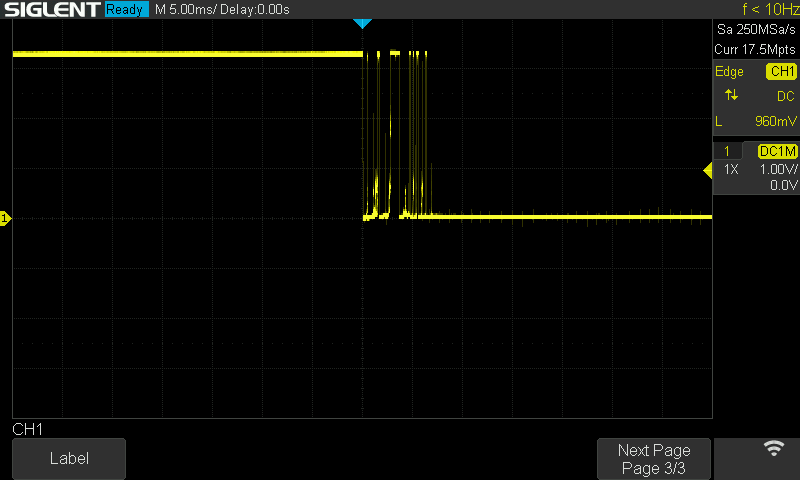

# Firmware
## Original Firmware
The original firmware has two parts, a custom bootloader and the actual application.  
The bootloader is located at the start of flash (0x800 0000) and is 0x8000 (32K) bytes in size.  
The main application is placed after the bootloader at 0x800 8000.  
The bootloader does not perform any checks to verify firmware integrity (like checksums etc.), it just blindly calls the reset vector of the firmware.
Official firmware update .bin files are unencrypted and are copied to the firmware flash location during firmware updates.
  
The startup sequence looks something like this:

TODO flow chart


## Custom Firmware
This is an example on how to make custom firmware boot on the MDP-M01 while leaving the original bootloader untouched. The example project, located in [fw/custom_fw/m01_re](fw/custom_fw/m01_re), is just a scrappy proof of concept test project to try out a few peripherals. It's built on top of STM's HAL libraries and code generation using CubeMX.  

The project is based on STM32CubeIDE and can be opened and built with it. (currently there is only a Debug build profile)

Since Eclipse makes me a bit sad though, the project also includes some CLion configs (CLion directly supports STM32CubeIDE projects), including several build profiles. When opening a CubeIDE project in CLion, a `CMakeLists_template.txt` file is used to generate a CMakeLists file based on CubeIDE settings, which CLion parses from the CubeIDE config files (such as `.cproject`). Do not edit the CMakeLists directly, as CLion generates it every time it detects changes in the CubeIDE files. I heavily edited the default template that CLion provides to add extra compile/link flags etc.  
Note that for these configs to work, you will have to create a toolchain config (in Settings -> Build, Execution, Deployment -> Toolchains) named "stm32" that uses the STM32 version of the arm-none-eabi toolchain, and possibly some other things that I'm not thinking of at the moment.  
The STM32 version of the arm-none-eabi toolchain is provided by STM [on Github](https://github.com/STMicroelectronics/gnu-tools-for-stm32). (if you don't want to compile from source and have CubeIDE installed, the binaries can be found in the CubeIDE install directory in `Contents/Eclipse/plugins/...externaltools.gnu-tools-for-stm32.../`)


### To make custom firmware boot successfully, we have to:

### 1. change the start of the flash memory in the linker script
Since the bootloader takes up the first 0x8000 bytes of our flash and the firmware is placed directly behind that, we have to tell the linker that our firmware will be placed at 0x8008000.
In the linker script (`STM32F103VCTX_FLASH.ld`), we can set the origin of the flash region to `0x8008000` and change the length of the section to match.

```
MEMORY
{
  RAM    (xrw)    : ORIGIN = 0x20000000,   LENGTH = 48K
  FLASH    (rx)    : ORIGIN = 0x8008000,   LENGTH = 224K
}
```

### 2. set the vector table offset register (SCB->VTOR) to match the location of our firmware's vector table
This has to be done during the init phase after the reset vector is called by the bootloader, before the main() of out custom firmware is called.
In this case, our vector table starts at 0x8008000 since the first 0x8000 bytes are reserved for the bootloader and the firmware is placed directly after that.

STM32 HAL has a way to do that:
- in `system_stm32f1xx.c`, uncomment `#define USER_VECT_TAB_ADDRESS` and set `VECT_TAB_OFFSET` to `0x8000`


## Flashing/Debugging
$\color{#FF4444}{\textsf{!!! WARNING !!!}}$  
$\color{#FF4444}{\textsf{It is possible to hard-brick the M01, please read this entire warning.}}$ With STM32-style MCUs, the SWD pins have to be enabled in software for a debug probe to be able to connect to them. Both the factory bootloader and firmware do enable them. If you flash your own firmware (in which you forget to enable the SWD pins) over the original firmware, you will no longer be able to connect to the device while your firmware is running. If the factory bootloader is still in place, you can hold the A button while powering on the M01. It will then enter DFU mode, in which the SWD pins are enabled, and you should be able to connect to it again. If you overwrite the factory bootloader with firmware that does not enable the SWD pins you will no longer be able to connect and it's time to open up the M01 (unless you are happy with whatever you flashed). Unfortunately the BOOT0 pin is directly hardwired to ground (not through a pull down), so you will have to lift the pin from the PCB and connect it to Vcc while powering on the M01. The STM32 should then boot into its builtin bootloader and you should be able to connect again, but I've never tried this. Before writing anything to the device it's also a good idea to dump the factory bootloader, since it's not publicly available.  
$\color{#FF4444}{\textsf{!!! WARNING !!!}}$  

<br>

The SWD lines are broken out to the micro USB D+/D- lines (DIO to D+ and CLK to D-) and the MCU comes with neither read nor write protections enabled. Using a USB breakout board makes it very easy to connect an ST-Link (or other debug probe of choice) to the device without even having to open it up. 

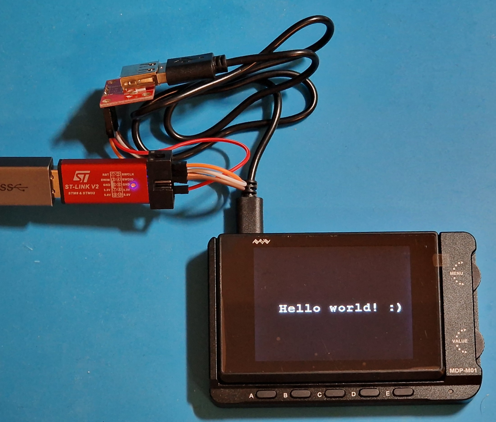

### Flashing
There are two ways to flash firmware.

#### ST-Link
One easy way to read from and write to flash is STM's CubeProgrammer along with an ST-Link debug probe. 
CubeProgrammer with ST-Link works for both STM32 and GD32.  

#### Factory bootloader
It is also possible to use the bin firmware update method described in the official firmware update instructions, since the bootloader just accepts whatever bin file you give it.


### Debugging
Debugging can be a bit more complicated. While the ST-Link GDB Server works perfectly fine with STM32, it refuses to connect to the GD32 clone with the error message: `ST-LINK: Could not verify ST device! Abort connection.`  
Luckily, OpenOCD works with STM32/GD32 and various debug probes, including ST-Link, as long as you use the correct config file.
To get debugging to work with my setup (cheap 7€ ST-Link v2 clone), I used the STM32 config files provided by OpenOCD as a basis and modified them to fit my setup. 
I included the config files in the [example project](/fw/openocd/). Note that if you use the wrong config file (e.g. gd32f1x.cfg when your chip is an F3x), OpenOCD will complain about an ID mismatch and refuse to launch with the error message:  
```
Warn : UNEXPECTED idcode: 0x2ba01477
Error: expected 1 of 1: 0x1ba01477
```  
While using the correct config file should fix this, you *can* also add/uncomment `set CPUTAPID 0` near the top of the config file, which will make OpenOCD not care about the ID. While this will remove the check to make sure the config fits the MCU, who knows when it might come in handy with these clones.  

Another thing worth mentioning is that, with GD32, OpenOCD produces this warning (but caused no issues for me):
```
Warn : STM32 flash size failed, probe inaccurate - assuming 512k flash
Info : flash size = 512 KiB
```
With STM32, this warning is not present, so likely just a clone-thing.